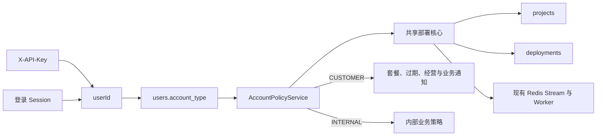

# PreviewShip 内部部署账号设计

- 状态：已批准
- 日期：2026-07-15
- 关联 ADR：[内部部署通过账号类型复用共享核心](../adr/0002-internal-deployments-share-core-by-account-type.md)
- 领域术语：[CONTEXT.md](../../CONTEXT.md)

## 1. 背景

公司内部项目需要复用 PreviewShip 已有的静态产物部署能力，支持 React、Vue 等框架的构建产物以及单个 HTML、Markdown、PDF 文件。调用方需要通过 API 创建部署、查询状态和 URL、查看项目与部署记录、重新部署、回滚和删除项目；授权维护人员也需要使用同一账号正常登录控制台。

现有部署链路已经包含项目同名复用、全局托管 slug 防冲突、成功版本激活、失败保护、产物规范化、固定 URL、访问控制、回滚和 Abuse 封禁。内部需求不应复制这套能力，也不能让内部行为污染普通用户的套餐、增长、经营统计、营销事件和业务邮件。

## 2. 目标

- 复用现有数据表、标准 `/v1` API、部署服务、Redis Stream、Worker 和托管实现。
- API Key 和登录 Session 对同一账号得出完全一致的内部身份。
- 内部账号不受商业套餐额度、预览过期、版本数量和品牌角标限制。
- 保持文件、压缩包、并发、权限、路径和 Abuse 等安全保护。
- 内部账号可维护自己的全部资源，但不获得平台管理员权限。
- 内部数据不进入增长经营、激活、获客、日报或营销链路。
- 普通用户行为和现有 API 兼容性不发生回归。

## 3. 非目标

- 不创建独立内部项目表、部署表或第二套部署接口。
- 不支持 React、Vue 等源码的依赖安装和构建。
- 不建设团队成员、个人操作审计、MFA 或多 API Key 模型。
- 不新增构建日志 API。
- 不修复现有队列可靠性、本地临时文件、多副本可见性或存储容量问题。
- 不隔离内部与普通用户的队列、Worker、PVC 或运行资源。

## 4. 方案选择

### 4.1 采用：共享核心，按账号类型分流

在 `users` 上保存稳定的账号类型，所有入口解析到 `userId` 后读取同一个账号策略。项目和部署继续按 `user_id` 归属，内部账号与普通账号共用核心服务。

### 4.2 未采用：独立表和独立接口

该方案隔离最强，但会复制项目唯一性、托管 slug、访问控制、状态机、回滚、清理和 Worker 逻辑。两条链路会逐渐产生行为差异，维护成本高于本需求收益。

### 4.3 未采用：特殊邮箱、用户 ID 或 API Key 硬编码

该方案改动少，但 Session 登录与 API Key 调用容易产生不同身份；轮换 Key、修改邮箱或迁移账号也会改变业务语义，且难以系统性排除统计与通知。

## 5. 总体架构

`account_type` 是唯一身份来源。请求网络位置、`source` 参数、邮箱、API Key 文本和 Controller 路径都不能改变账号类型。

## 6. 数据模型

### 6.1 users.account_type

新增非空字段：

- `CUSTOMER`：默认值，保持所有现有行为。
- `INTERNAL`：公司内部部署账号。

迁移时所有已有用户回填为 `CUSTOMER`。公司专属账号正常注册并完成验证后，由受控运维 SQL 或脚本设置为 `INTERNAL`。不提供前台或管理后台切换入口。

内部身份对账号全部历史和未来数据生效。正式账号应使用全新、未产生普通用户行为的专属账号。内部身份不恢复成 `CUSTOMER`；停用时将账号状态设为 `BLOCKED` 并撤销 API Key。

### 6.2 deployments.rollback_source_deployment_id

新增可空的同表来源标识：

- 普通上传和普通重新部署为空，除非后续明确建立来源语义。
- 回滚产生的新部署保存被选择的历史部署 ID。
- 使用 `ON DELETE SET NULL`，避免项目删除或历史清理受到自引用约束阻塞。
- 服务层验证来源部署与新部署属于同一项目和同一账号。

不在 `projects` 或 `deployments` 重复保存 `is_internal`。账号类型是追溯式业务身份，重复快照会引入不一致来源。

## 7. 账号策略

新增集中式 `AccountPolicyService`，由 `userId` 返回不可变能力对象。Controller 不直接判断账号类型，Worker、清理任务、访问控制、事件、邮件和统计也不自行硬编码特殊用户。

内部策略包括：

- `businessQuotaApplied=false`
- `previewExpires=false`
- `retainAllSuccessfulArtifacts=true`
- `brandingInjected=false`
- `passwordAccessAllowed=true`
- `growthAnalyticsIncluded=false`
- `businessEmailAllowed=false`
- `accountSecurityEmailAllowed=true`
- `maxApiKeys=1`

安全并发和上传保护不通过虚构的 `Integer.MAX_VALUE` 表示。它们属于独立的技术安全配置，不作为会员套餐权益，也不显示在内部控制台。

## 8. 鉴权与权限

### 8.1 API Key

保持 `X-API-Key` 和现有 `ApiKeyAuthFilter`：

1. Key 哈希查找 `ApiKey`。
2. 取得 `userId`。
3. 校验用户状态。
4. 业务服务通过 `userId` 读取账号策略。

内部账号正常状态只有一个共享 API Key，所有公司调用方共用。轮换继续采用“先撤销旧 Key，再创建新 Key”，接受中断窗口。

共享 Key 完整复用现有 `/v1` 权限，包括部署、查询、列表、重新部署、回滚、访问方式修改和项目删除。系统只审计到内部账号和共享 Key，不能区分具体调用服务。

### 8.2 Session

登录流程不变。`GET /me` 增加向后兼容的 `accountType` 字段。多个维护人员可以共用账号并同时登录，但所有会话只归属于该账号。

内部账号不是平台管理员，不能访问经营驾驶舱、Showcase 审核、邮件 Campaign 或其他用户资源。现有 Abuse 管理员仍可封禁内部账号、项目和部署。

## 9. 部署数据流

### 9.1 创建部署

1. 从 SecurityContext 取得 `userId` 和可选 `apiKeyId`。
2. 校验用户、项目状态、项目名和上传产物。
3. 读取账号策略。
4. 按 `(user_id, project_name)` 精确查找项目。
5. 内部账号跳过项目数、部署次数和累计上传量消费；普通账号保持原逻辑。
6. 继续执行访问方式、托管 slug、防覆盖和数据库唯一约束校验。
7. 保存上传文件、部署记录并投递现有 Redis Stream。
8. 返回现有异步受理响应，不增加预览 URL。

内部项目名保持原始字符串精确匹配。`Portal`、`portal` 和 ` portal ` 是三个项目。数据库现有 `(user_id, name)` 唯一约束继续防止完全同名项目并发重复创建。

### 9.2 产物类型

继续支持：

- 包含根 `index.html` 的静态 ZIP。
- `dist/`、`build/`、`out/`、`public/`、`.output/public/` 等构建输出。
- Vercel Build Output 静态目录。
- 单个 HTML、Markdown 和 PDF 文件。

继续拒绝包含 `package.json`、`src/` 等特征且没有静态入口的未构建源码。现有路径穿越与格式校验保持生效。

### 9.3 成功、失败和并发

- 只有成功部署可以替换固定 URL 当前内容。
- 失败部署保留失败记录和摘要，不影响上一个成功版本。
- 不自动重试；调用方重新提交时创建新部署记录。
- 并发部署继续以最后完成并成功激活的部署为当前版本。
- 激活当前版本时应对项目加数据库写锁，使托管指针和 `latestDeploymentId` 的变更顺序一致。

内部部署的 `preview_expires_at` 和 `artifact_expires_at` 使用 `NULL` 表示不自动过期。Cleanup Scheduler 必须显式排除内部账号，不能依赖一个极大的未来日期。

内部 HTML 不注入 PreviewShip 角标；Markdown、PDF 的必要静态包装仍属于产物处理，不视为品牌注入。

## 10. 回滚与版本历史

当前 `ProjectVersionService.rollback` 会同步发布并修改原部署记录，必须改为共享异步链路：

1. 校验项目所有权、来源部署状态和保留产物。
2. 允许来源为当前部署。
3. 复制来源 ZIP 到现有待处理目录。
4. 创建新的 `QUEUED` 部署记录。
5. 写入 `rollback_source_deployment_id` 和明确的部署来源。
6. 投递现有队列。
7. 返回新部署 ID，由调用方查询成功或失败。

原历史部署保持不可变。回滚失败不影响当前版本；回滚成功后按正常激活规则成为当前版本。

内部版本历史包含全部状态和全部时间范围，不按套餐数量截断。版本接口增加分页参数，默认 20、最大 100，并保留现有 `versions` 字段以降低客户端改造。只有状态成功且产物仍存在的版本返回 `canRollback=true`。

## 11. 项目生命周期

- 内部固定 URL 不因时间或套餐状态过期。
- 每次成功部署的原始回滚产物保留到项目删除。
- 删除项目继续使用现有清理链路，删除在线目录、回滚产物、Showcase 关联、构建日志、部署记录和项目记录。
- Abuse 封禁优先于长期保留，可下线固定 URL 并删除在线内容和回滚产物。
- 内部项目默认公开，可使用密码访问，不支持新增的第三种内部可见性。
- 内部项目可由账号主动提交 Showcase；Showcase 展示不改变内部业务身份。

## 12. 控制台

控制台根据 `accountType` 选择内部维护视图，而不是把内部账号伪装成 Pro：

- 保留 Dashboard 技术概览、部署、项目、版本、回滚、访问设置和 API Key。
- 隐藏套餐徽标、Usage 商业额度、升级提示、预览到期提示、Billing 导航和营销组件。
- 客户端上传、密码访问和项目创建判断使用账号能力，不再仅以 `plan === FREE` 判断。
- 不新增平台管理员页面或跨用户能力。

按已确认范围，只隐藏 Billing 前端入口，不阻止内部账号直接调用现有 Stripe 后端接口。若产生订阅或支付，它们不改变内部账号策略，也必须从增长经营统计中排除。

## 13. 统计、事件、邮件和可观测性

### 13.1 产品与经营数据

采用两层隔离：

1. `ProductEventService` 和服务端状态事件在写入前识别内部账号并跳过业务事件。
2. 所有经营 SQL 连接 `users` 并限制 `account_type = 'CUSTOMER'`，防止历史事件、支付事实或漏网写入污染报表。

需要覆盖管理员增长驾驶舱、激活与二次部署、获客旅程、结账、订阅、支付、数据质量指标、Feishu 日报和营销 Campaign 受众。

### 13.2 技术可观测性

继续保留并标注内部身份：

- 部署状态和失败码。
- 服务端构建日志。
- 处理耗时和队列/Worker 指标。
- 系统健康、异常和 Abuse 审计。

不新增 `/v1` 构建日志接口。现有构建日志保留策略保持不变。

### 13.3 邮件

内部账号只允许验证码和密码恢复邮件。部署成功、预览到期、订阅状态、召回和营销邮件全部跳过。Stripe 自身发送的外部收据不在 PreviewShip 邮件策略控制范围内。

## 14. API 兼容性

- 不新增内部专用 Controller 路径。
- 普通用户请求和响应保持现状。
- `/me` 只增加 `accountType`。
- 创建部署继续返回 `deploymentId`、状态等现有字段，不增加 URL。
- 部署查询成功后继续通过 `previewUrl` 返回固定链接。
- 版本查询增加分页元数据但保留 `versions`。
- 内部 Usage 接口返回明确的 `businessLimitsApplied=false`，不返回伪造的超大套餐数字；内部控制台不展示该商业用量卡片。

## 15. 错误处理

- 无效/撤销 Key、封禁账号、跨账号资源访问继续返回现有鉴权和所有权错误。
- 格式、路径、缺少入口文件、文件安全和访问密码错误继续使用现有稳定错误码。
- 部署失败写入 `FAILED`、`failureCode` 和错误摘要，不自动重试。
- 回滚来源不存在、跨项目、非成功状态或产物缺失时拒绝创建新部署。
- 创建受理接口不因已有项目当前版本可用而掩盖新部署失败。

按批准范围，不新增数据库与 Redis 的事务 Outbox 或投递失败补偿。现有投递失败可能留下 `QUEUED` 记录和孤儿文件。

## 16. 明确接受的运行风险

- 内部和普通部署共用同一 Redis Stream 与 Worker，内部高峰可增加普通用户等待时间。
- 所有产物共用现有 PVC，内部长期保留可消耗普通用户可用容量。
- 待处理 ZIP 继续位于 Pod 本地 `/tmp`；多副本和滚动发布可能由另一个 Pod 消费而读取失败。
- 数据库保存和 Redis 投递不具备原子性，失败可能形成永久 `QUEUED` 记录。
- 一个共享 API Key 拥有完整 `/v1` 权限，泄露或误操作可能影响账号下全部项目。
- Key 轮换存在无可用凭证窗口。
- 共享登录和共享 Key 都不能识别具体维护人员或调用服务。

因此，“内部与普通用户互不影响”限定为业务身份、权限、生命周期、统计、事件和邮件不串线，不包含运行资源和交付可靠性的物理隔离。

## 17. 测试与验收

### 17.1 身份与权限

- 新字段迁移后所有已有账号均为 `CUSTOMER`。
- 同一内部账号通过 Session 和 API Key 得到相同策略。
- 请求参数、邮箱和 Key 名称不能伪造内部身份。
- 内部账号只能访问自身资源，不能访问平台管理能力。
- 封禁账号和撤销 Key 后两种入口立即失效。

### 17.2 普通用户回归

- FREE、月付、年付的项目、上传、并发、过期、品牌和密码权限全部保持原行为。
- 普通用户现有部署、回滚、Usage、Billing、Showcase 和邮件测试继续通过。

### 17.3 内部部署

- 跳过商业额度但保留安全校验。
- 项目名精确匹配和并发同名创建不产生重复项目。
- 固定 URL 和回滚产物不被时间/数量清理。
- 不注入品牌角标，不发送业务邮件，不记录产品增长事件。
- 失败不替换当前版本，不自动重试。
- 并发成功部署按最后成功激活规则更新固定 URL。

### 17.4 回滚与历史

- 回滚历史版本和当前版本都创建新部署记录。
- 新记录正确关联来源，原记录所有字段不变。
- 回滚异步状态、失败保护、无品牌和长期保留与普通内部部署一致。
- 历史分页边界、排序、所有状态和 `canRollback` 正确。

### 17.5 数据隔离

- 管理员经营查询、日报、激活、二次部署、Checkout、订阅、支付和数据质量均排除内部账号全部历史。
- Showcase 仍能显示主动提交的内部项目。
- 技术日志、错误码和监控仍能定位内部部署。

## 18. 发布与回退

建议按以下顺序发布：

1. 数据库迁移与账号策略基础设施，所有账号仍为 `CUSTOMER`。
2. 部署、回滚、过期、产物、品牌、访问控制和 API 响应适配。
3. 产品事件、经营 SQL、日报和邮件隔离。
4. 控制台内部维护视图。
5. 完成全量回归后注册专属账号并由运维设置为 `INTERNAL`。
6. 创建共享 API Key，使用测试项目验证部署、失败、并发、回滚、密码访问、删除和统计隔离。

代码回退时先封禁内部账号并撤销 Key，再回退应用。数据库字段保持兼容，不立即删除；只有确认不存在 `INTERNAL` 数据和回滚来源引用后，才考虑逆向迁移。
