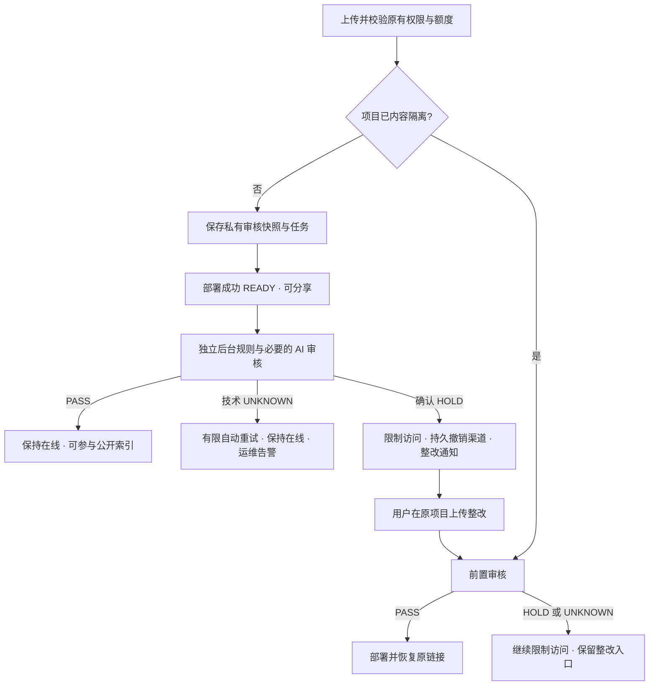

# 发布与后台内容审核分离

## 已批准范围

普通项目沿原上传、额度校验、规范化、渠道创建及激活流程发布。AI 内容审核移为独立、持久化后台任务。已确认危险内容自动撤销访问并通知整改；技术错误不能直接认定用户违规。已限制访问的项目允许上传整改，整改版本通过前置审核后才创建公开渠道并恢复原链接。没有人工审核队列。

## 状态与任务

部署状态继续使用 QUEUED、BUILDING、READY、SUPERSEDED、FAILED、EXPIRED、BLOCKED。READY 表示渠道发布完成；内容审核使用 PENDING、CHECKING、RETRYING、COMPLETED，与部署等待分开。确认风险的公开部署转 BLOCKED，保留 readyAt；项目维持 ACTIVE，另持久化内容隔离标记，管理员 Abuse 封禁语义保持不变。

复用每 deployment 唯一的 ContentRiskCheck，新增规范化输入引用和租约。调用渠道之前将实际 preparedFiles 写入私有不可变快照并注册 PENDING；只有 READY/SUPERSEDED 的新后台记录可被调度。快照 hash 必须与审核及发布字节一致。旧记录不回填、不自动重审。数据库短事务领取任务，AI 在事务外运行；runId/hash 防止迟到结果覆盖，租约到期恢复，重试沿现有次数与时间预算。终态或取消后按有界规则清理输入。

审核 HOLD 在结果事务中持久化撤销任务；撤销调用必须确认成功或不存在，失败独立重试。仅风险部署及同项目相同 hash 副本被撤销；仅风险版本仍为 latest 时限制项目入口。旧 A 的迟到结果不能误封不同内容的 B，B 自身审核继续。归档、删除、过期或永久封禁后的任务不得恢复公开。

## 协作接口

- ContentRiskService.registerBackgroundReview(Deployment, Project, Map<String, byte[]>)：加入调用方事务，保存规范化快照和记录。
- ContentRiskService.requirePreparedForPublication(Long)：要求本次已有有效 PASS 或绑定快照的后台 PENDING 记录。
- ContentRiskService.requireNotKnownUnsafe(Map<String, byte[]>)：确认危险 hash 仍前置拦截。
- ContentRiskService.processDuePublishedReviews(int)：独立调度，仅处理新后台任务。
- ContentIsolationService.requiresPrePublishReview(Project/Long)：读取可整改隔离状态。
- ContentIsolationService.applyConfirmedRisk(Long, String, String)：在审核结果事务内隔离并入撤销任务。
- ContentIsolationService.clearAfterVerifiedActivation(Project, Deployment, String)：仅有效 PASS 的成功整改激活可清隔离。
- PreviewProvider.deleteDeploymentStrict(Project, Deployment)：确认撤销，错误交给持久重试。
- 用户部署详情/列表新增 urlStatus，项目详情暴露 contentRestricted；urlStatus 是可打开/复制的服务端事实。

## 用户交互

普通发布的按钮 loading 仅持续到部署成功或失败。READY 后立即可分享，非阻塞显示后台审核状态；页面有界继续查询审核，服务端任务独立于页面存活。发现风险后禁用所有打开/复制入口，显示固定原因、定位及整改操作。整改上传仍使用原项目，审核等待明确提示。技术 UNKNOWN 显示审核未完成，不显示违规或假称邮件已发送。游客无邮箱时只承诺站内状态；登录用户安全邮件使用现有 outbox、语言及去重机制。

## 系统边界

权限、会员项目数/部署次数/上传量/单包大小/并发构建/托管期、ZIP 路径和解压安全检查维持原权益。后台审核与撤销重试不另扣用户额度、不占构建并发、不延长托管期。后台私有审核快照独立于会员历史版本清理。已公开后下架不套用构建失败退款。

已确认风险和整改预审要在 provider.createDeployment 之前检查，激活时在同一项目锁下再检查。前台请求、Worker、回滚、归档恢复、游客/插件入口共享门禁。所有预览域名与独立渠道 URL 都需要撤销；数据库 BLOCKED 不等于渠道删除成功。缓存传播时间、已下载文件和浏览器安全名单恢复不保证瞬时完成。

先发布后审存在真实公开暴露窗口；AI 技术故障期间不保证最长窗口。不能为了审核通过率把 UNKNOWN/HOLD 改为 PASS。审核故障单独告警和记录，不使普通已经上线的部署最终 FAILED。未经审核的内容不进入公开 Showcase/自动索引放大入口。
